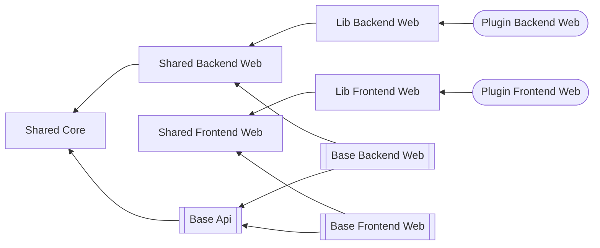

# Complete Information

## Package Structure

Packages with no release on nuget and only an release as part of an application, have an additional line left and right of the box.
Packages which are not part of this repo but rather part of the plugin repos are round.
